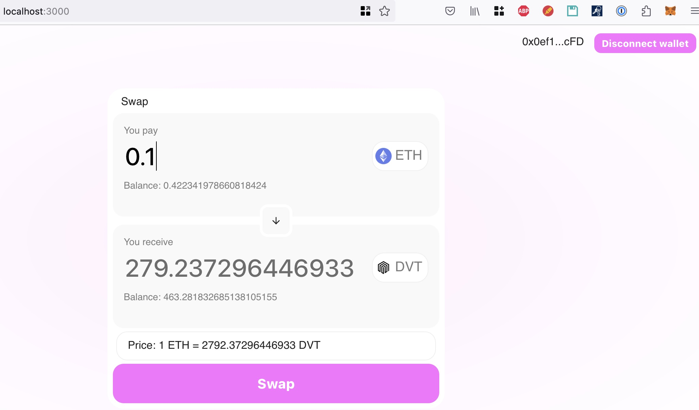

# Decentralised Exchange (DEX) 
Written in solidity, python, react js.
It supports only liquidity Pool with pair ETH, DVT (dev token).

## testnet & metamast
Sepolia testnet (blockchain) will be used.
Register at https://www.infura.io/ and get API key.
Create 'test' account in metamask wallet and switch to Sepolia testnet.
Create `dApp/.env`:
```
export WEB3_INFURA_PROJECT_ID=<infura_api_key>
export PRIVATE_KEY=<metamask_private_key>
```
Use Sepolia faucet  https://sepolia-faucet.pk910.de/ to generate fake ETH and send it to your wallet.

## dApp
Deploy solidity contracts to Sepolia testnet.
```bash
cd dApp
brownie run scripts/deploy.py --sepolia
```
Use `dApp/README.md` to issue DVT tokens and send it to wallet `dApp/README.md`, then add liquidity to DEX pool.

## frontend
Add addresses and abi's of deployed contracts to `frontend/src/contracts/TokenContract.js` and `frontend/src/contracts/DexContract.js`
```bash
cd frontend
npm -ci
npm start
```
Open http://localhost:3000/ in browser, click "connect wallet" and approve connection in metamask.
